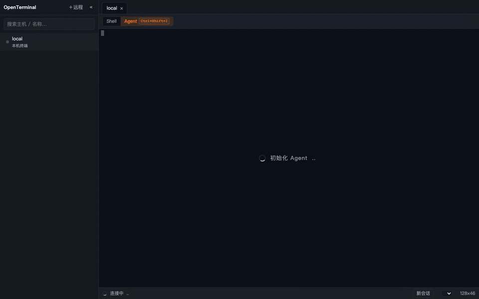
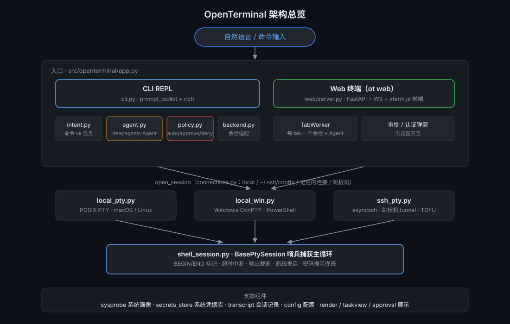

# OpenTerminal

[](https://github.com/JaquariusJ/OpenTerminal/actions/workflows/ci.yml)
[](LICENSE)

[English](README.md) | 中文

**用大白话指挥你的终端——活它来干。**

OpenTerminal 住在你的终端里(也可以住进浏览器)。你输入一句人话,比如
"帮我看看哪些文件占的空间最大",它自己琢磨出合适的命令、执行、再把结果
讲给你听。想直接敲命令也照常执行,一点不耽误。它还能 SSH 到远程服务器,
Xshell 可以省了。

<div align="center">
  
</div>

上面这张动图里发生了什么:

1. 你输入一句人话:**"在 /tmp 下新建一个名叫 ot-demo 的文件夹"**;
2. AI 先亮出**分析**——它打算干什么、为什么;
3. 建文件夹会改动系统,于是弹出**审批面板**——你点头之前,什么都不会执行;
4. 你点了**执行**——命令真实运行,输出原样展示;
5. 一张**总结**卡收尾,告诉你结果如何。

> ⚠️ **Beta 阶段**:OpenTerminal 会在真实机器上执行真实命令——包括生产
> 服务器。所有改动性命令都要经你审批(见[安全模型](#安全模型)),但点
> 「执行」之前,还是请看一眼它要干什么。

## 你为什么会喜欢它

- **说人话就行。** 自然语言进,正确的命令出,动手之前先把分析给你看。
- **它懂各家系统。** Ubuntu→apt、CentOS 7→yum、Rocky/Fedora→dnf、
  Alpine→apk、macOS→brew——同一句需求,每台机器都说对方的方言。
- **它不瞎来。** 只读命令自动跑;改动系统的等你审批;灾难命令
  (`rm -rf /`、fork 炸弹……)直接拒绝。失败了有界自纠(10 轮预算),
  不会无限重试刷屏。
- **你的 shell 还是你说了算。** 会话持久(`cd`、环境变量、venv 都在),
  vim/top/tmux 这类全屏程序自动接管终端,原生内联,零登记。
- **两种打开方式。** 单管线终端(`ot`),或者 `ot web`——浏览器里的服务器
  侧栏 + 多 tab 终端,底层是同一套核心。

## 快速开始

需要 Python 3.10+。

```sh
conda create -n openterminal python=3.12 -y
conda activate openterminal
pip install -e .
mkdir -p ~/.openterminal && cp .env.example ~/.openterminal/.env
# 编辑 ~/.openterminal/.env,填上你的模型网关(见下)
```

然后:

```sh
ot          # 终端——本机 shell + 主菜单(连接 / 管理主机)
ot web      # 浏览器终端——服务器侧栏 + 多 tab(默认 http://127.0.0.1:8080)
```

更多连接方式:

```sh
ot connect prod-web      # ~/.ssh/config 里的主机
ot ssh deploy@host:2222  # 直接指定 user@host:port
```

## 模型网关配置

OpenTerminal 对接任意 Anthropic 兼容网关。启动时依次加载当前目录 `.env`、
`~/.openterminal/.env`,然后读取 `~/.openterminal/config.toml`。**三个都
不建也能跑**——缺省用内置默认值:

- 网关:`http://127.0.0.1:15721`(Anthropic 兼容协议)
- 模型:`claude-sonnet-4-6`
- API Key:读环境变量 `ANTHROPIC_API_KEY`

`~/.openterminal/config.toml` 可选示例(所有字段均可省略):

```toml
[model]
base_url = "http://127.0.0.1:15721"
model = "claude-sonnet-4-6"
api_key_env = "ANTHROPIC_API_KEY"

[shell]
timeout_default = 120        # 单条命令最长等待秒数
max_output_bytes = 102400    # 单条命令输出截断
max_tool_turns = 10          # Agent 工具调用轮次预算

[policy]
mode = "tiered"              # tiered(分级)| approve-all | deny-all
# auto_extra / approve_extra / deny_extra 可追加精确匹配的自定义规则

[target.prod-web]
mode = "ssh"
host = "prod-web.example.com"
```

配置目录可用环境变量 `OPENTERMINAL_HOME` 覆盖(测试即用它做隔离)。
会话记录写入 `~/.openterminal/sessions/`,主机画像缓存在
`~/.openterminal/hosts.toml`。

## 日常使用

**终端里**——直接打字。说人话就是任务,敲命令就在你的真 shell 里跑。
`!` 强制命令、`?` 强制任务;`/target` 切主机、`/system` 手动方言、
`/clear` 新任务、`/model` 查看模型、`/exit` 退出;Ctrl+C 中断当前任务,
回到提示符。

**浏览器里**(`ot web`)——侧栏选服务器(local / 直连 / 经跳板机),
tab 想开几个开几个,Agent 视图和纯 Shell 视图随意切换。密码、主机密钥
用浏览器弹窗输入;记住的密码走系统凭据库,下次连接直接免密。

**局域网访问**:`ot web --host 0.0.0.0 --token <TOKEN>`——绑定非本机地址
必须带 token。配置:`config.toml` 的 `[web] host/port/token`。

**跳板机**在界面的「管理主机」里统一维护(存
`~/.openterminal/connections.toml` 的 `[[jumps]]`)。经跳板机连接会先连
jump 再隧道到目标,密码认证的跳板机也能用,记住密码同样走系统凭据库。

## 安全模型

一句话:**只看随便看;要动手得经你同意;闯祸的事直接不做。**

三级命令策略(`src/openterminal/policy.py`):

- **auto**:纯查看类自动执行——`ls`/`cat`/`df`/`ps`、`git status/log`、
  不带 `-exec/-delete` 的 `find` 等;
- **approve**:改动系统的都要审批——删文件、写文件、装软件、
  `systemctl`、`sudo`、网络配置,以及静态规则拿不准的命令。弹审批面板,
  `y` 执行 / `e` 编辑 / `n` 拒绝 / `a` 本会话始终允许(Web 界面是按钮,
  高危命令还有二次确认);
- **deny**:灾难命令直接拒绝,拒绝原因回灌给模型让它改道——
  `rm -rf /`、mkfs、`dd` 写块设备、fork 炸弹、关机重启、重定向到 /dev 盘等。

被拒和失败的命令不会被原样重试:系统提示词规定同一失败最多重试一次、
被拒命令不得换皮重试,工具调用轮次也有预算上限。

## 架构

<div align="center">
  
</div>

三层结构:自然语言前端(终端或 Web)、deepagents(LangGraph)Agent、
持久 shell 会话。自然语言直接交给 Agent 多轮调用工具,命令执行是 Agent
的子能力(经同一会话);三级策略在 Agent 中间件层强制,提示词内容绕不过
审批闸门。

命令输出用 BEGIN/END 哨兵标记切分(`shell_session.py`),实时流给界面;
单会话内命令严格串行——一个 PTY 就是一条交互 shell,Agent 并发发起的
execute 会排队。

项目**没有模型级长期记忆**——Agent 的 checkpointer 在内存里,重启即清空。
持久化的是"事实型"数据:

| 存储 | 位置 | 内容 |
|---|---|---|
| 配置 | `~/.openterminal/config.toml` | 模型网关 / shell 超时 / 策略 / 目标 |
| 连接 | `~/.openterminal/connections.toml` | 记住的连接 + 跳板机 |
| 密码 | 系统凭据库(keyring) | 不落明文文件 |
| 主机画像缓存 | `~/.openterminal/hosts.toml` | 免重复探测 |
| 会话记录 | `~/.openterminal/sessions/<日期>/` | 输入/命令/审批/总结的 JSONL |
| 主机密钥 | `~/.ssh/known_hosts` | TOFU 确认后写入 |

## 测试

```sh
pytest -q                      # Python 测试套件(平台门控自动跳过)
node --test tests/js/*.test.cjs                        # 静态前端
cd src/openterminal/web/frontend/ui && npm ci && npm test  # React island
```

真实 sshd 门控测试需要显式开启:

```sh
OT_TEST_SSH=1 OT_TEST_SSH_HOST=127.0.0.1 OT_TEST_SSH_PORT=2222 pytest -m ssh
```

## 贡献

见 [CONTRIBUTING.md](CONTRIBUTING.md)。欢迎提 Issue 和 Pull Request。

## 致谢

- [deepagents](https://github.com/langchain-ai/deepagents) & LangGraph — Agent 运行时
- [xterm.js](https://xtermjs.org/) — 浏览器终端(内置于 `web/frontend/vendor/`)
- [asyncssh](https://github.com/ronf/asyncssh) — SSH 客户端

## 许可证

[Apache License 2.0](LICENSE)
