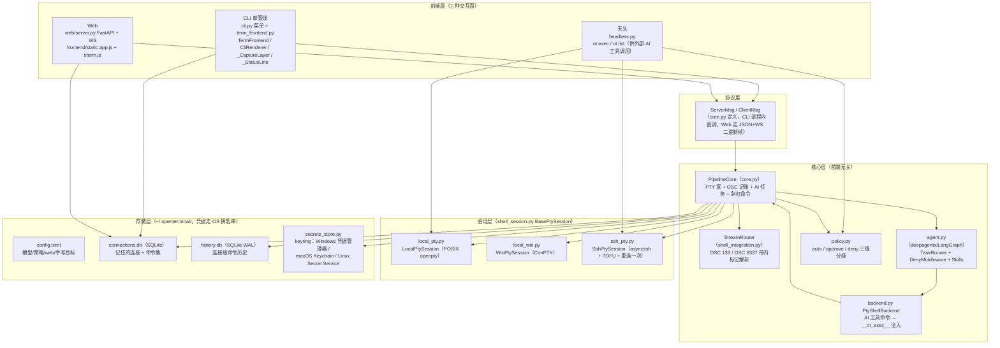

# OpenTerminal 架构文档

> 状态：与代码同步（分支 feat/single-pipeline，2026-09）
> 配套阅读：[设计说明](design.md) · [流程图](flows.md) · [单管线设计定稿（历史）](design-single-pipeline.md)

## 1. 系统定位

OpenTerminal（`ot`）是一个 **AI Agent 内嵌的真终端**：本地 / SSH 远程 shell 的全部
终端能力（Tab 补全、历史、vim/top 全屏程序、嵌套 shell、颜色）交给 PTY + 真实
shell 原生提供，项目自身只做三件事：

1. **意图路由**——敲命令就是命令，说人话就交给 AI；
2. **AI 任务**——思考流、工具命令执行、人机审批（HIL）、失败救援、总结；
3. **呈现美化**——内联卡片、状态行、思考框、主题配色。

核心架构原则是**单管线**：PTY 字节流是唯一的显示管线，AI 输出以带内事件的形式
叠加渲染，不做第二套显示路由、不维护命令白名单。

## 2. 分层总览



## 3. 模块职责表

| 模块 | 行数≈ | 职责 |
|---|---|---|
| `app.py` | 50 | `ot` 入口：banner → `ot web` 分流 / `Cli` 主循环 / headless 分流 |
| `cli.py` | 400 | 主菜单、连接目标选择、主机管理（增删改）、`_run_pipeline` 两段构造 |
| `term_frontend.py` | 1340 | CLI 单管线前端：raw 输入泵、串行渲染 outbox、本地截获层、内联渲染器、状态行、思考框 |
| `core.py` | 1880 | `PipelineCore`：连接编排、PTY 泵、OSC 记账、AI 任务生命周期、斜杠命令、审批/救援/认证事件、命令集执行；`ServerMsg`/`ClientMsg` 协议定义 |
| `shell_integration.py` | 1030 | shell hook 注入脚本（bash/zsh/pwsh）、`StreamRouter` OSC 标记增量解析、注入行工具函数 |
| `agent.py` | 350 | Agent 装配：模型、系统提示词、`DenyMiddleware`（灾难命令拒绝）、`TaskRunner`（流式事件、中断、轮次预算）、Skills 挂载 |
| `backend.py` | 66 | `PtyShellBackend`：把 ShellSession 适配成 deepagents 的沙箱后端，`execute` 走 `__ot_exec__` 注入 |
| `policy.py` | 240 | 命令分级：auto（只读自动）/ approve（高危审批）/ deny（灾难拒绝） |
| `shell_session.py` | 320 | `BasePtySession`：哨兵主循环、超时、输出截断、断线恢复骨架 |
| `local_pty.py` / `local_win.py` | 180/170 | 本地会话：POSIX openpty 非阻塞读 / Windows ConPTY |
| `ssh_pty.py` | 250 | SSH 会话：asyncssh PTY 通道、密码/密钥认证回调、TOFU known_hosts、断线重连一次 |
| `connections.py` | 230 | 记住的连接 CRUD、`open_session` 会话工厂、密码补存（`_backfill_password`） |
| `connections_db.py` | 175 | SQLite 存储层：schema、TOML 一次性迁移、跳板机下线收尾迁移（`_retire_jumps`） |
| `config.py` | 120 | `~/.openterminal/config.toml` 加载：模型/shell/策略/web/手写目标 |
| `secrets_store.py` | 46 | keyring 统一封装，不可用时静默降级（读 None / 写 False） |
| `cmdset.py` | 50 | 连接后命令集：内联密码抽取入 keyring、`@引用` 应答解析 |
| `history_db.py` | 80 | 连接级命令历史（SQLite WAL，多进程并发安全），重连时灌回远端 shell history |
| `sysprobe.py` | 165 | 目标系统画像探测（发行版/包管理器/服务管理器），带主机缓存 |
| `token_est.py` | 50 | tiktoken 本地 token 估算（网关不回传 usage 时的兜底口径） |
| `taskview.py` | 185 | 任务级展示策略（rich 无关的纯逻辑，Web/富 CLI 用） |
| `headless.py` | 270 | `ot exec` / `ot list`：结构化 JSON、退出码分层（远程 <64 透传，工具错误 ≥64） |
| `render.py` / `banner.py` | 40/40 | rich 输出助手 / 启动横幅 |
| `web/server.py` | 300 | FastAPI：REST（targets/tabs/saved CRUD）+ WS 二进制帧桥接 PipelineCore |
| `web/frontend/static/` | — | 原生 JS + xterm.js：全屏终端、decoration 锚定 AI 卡片、审批/总结渲染 |

## 4. 协议：ServerMsg / ClientMsg

CLI 与 Web 共用同一对消息结构（`core.py` 定义）：

- **CLI**：进程内直调——`CliCore.emit_msg/emit_bytes` 把下行消息塞进
  TermFrontend 的串行渲染 outbox；上行经 `core.feed_input`（键盘字节）/
  `core.feed_msg`（结构化）。
- **Web**：`ServerMsg` JSON 编码走 WS 文本帧，PTY 字节走 WS 二进制帧；
  上行 `ClientMsg` 反向。

**下行（ServerMsg.type）**：`ready`（连接信息 + AI 就绪位）、`event`（AI 事件
dict：task_start / ai_token / ai_think / ai_collapse / ai_card / final / denied /
decide / rescue / rescue_decide / error / limit）、`approval`（待审批命令 +
风险级）、`ask_password` / `ask_host_key`（认证截获）、`status`、`usage`
（token 计数）、`cmdset`（命令集进度）、`stage`（连接阶段）、`closed`。

**上行（ClientMsg.type）**：`raw`（键盘字节直通 PTY）、`decision`（审批决策）、
`rescue`（救援 y/n）、`auth`（密码/主机密钥应答，可带 remember）、
`interrupt`、`mode`、`resize`、`change_model`、`submit`（前端拦截的自然语言
整行）、`pad`（卡片占位行）、`boundary_settled`、`new_session`、`close`。

## 5. 进程与并发模型

### CLI（单进程 asyncio）

```
主事件循环
├── stdin 泵        loop.add_reader(stdin)（POSIX）/ run_in_executor（win32）
│                   键盘字节 → _CaptureLayer 判定 → core.feed_input
├── PTY 输出泵      core._pump_loop：session 读字节 → StreamRouter 记账
│                   → 前端 outbox
├── 渲染 outbox     串行队列：("bytes", d) 直写 stdout；("msg", m) 走
│                   CliRenderer（rich Console 经 _WriterFile 适配器）
├── 状态行          _StatusLine：spinner + 计时 + token，\r\x1b[K 擦除协议
└── AI 任务         TaskRunner 协程（可被 Ctrl+C 取消）
```

关键纪律：**所有写 stdout 的路径最终汇到一个串行 outbox**，保证 PTY 字节、
rich 面板、流式 token、状态行擦除相互之间不交错。

### Web（uvicorn 多 tab）

每个 tab 一个 `PipelineCore` + 会话实例；WS 连接桥接消息。REST 管理面
（targets / saved CRUD）与数据面（WS）分离；非回环绑定强制 token。

## 6. 带内记账：OSC 标记（shell hook）

核心不解析屏幕、不猜提示符——shell 集成脚本（首次连接注入，bash/zsh/pwsh）
在带内发两组 OSC 标记，`StreamRouter` 增量解析：

| 标记 | 语义 |
|---|---|
| `ESC]133;A;<i>BEL` | 提示符开始（i = shell 实例号，区分嵌套） |
| `ESC]133;B;<i>BEL` | 提示符结束 / 用户输入开始 |
| `ESC]133;C;<i>BEL` | 命令开始执行（Enter hook 放行前） |
| `ESC]133;D;<ec>;<i>;<cwd>BEL` | 执行结束（退出码 + cwd） |
| `ESC]6337;<i>;CMD…` | 用户命令行报告（→ history_db、AI 上下文） |
| `ESC]6337;<i>;AI…` | Enter hook 判定为自然语言 → 上报 AI 任务 |
| `ESC]6337;<i>;EXEC…` | `__ot_exec__` 工具命令的执行报告 |

hook 的 Enter 绑定同时负责**意图分类**：`?` 前缀强制 AI、`!` 前缀强制命令、
`/` 前缀斜杠命令、其余行走启发式 + LLM 兜底（`_llm_classify`）。提交时 hook
把输入行重绘为青色（单管线下的输入回显美化）。

## 7. 存储布局

| 位置 | 内容 | 备注 |
|---|---|---|
| `~/.openterminal/config.toml` | 模型、策略、web、手写目标 | 手写目标只读，不被管理界面覆盖 |
| `~/.openterminal/connections.db` | 记住的连接（name/host/port/user/commands） | SQLite；密码不落库 |
| `~/.openterminal/history.db` | 每 target 命令历史 | WAL，CLI/Web 多进程并发 |
| OS 钥匙串（keyring） | 连接密码、命令集内联密码（`cmdset:名称`） | 不可用时静默降级为现场询问 |
| `~/.openterminal/.env` | 模型网关 API key | |
| `~/.ssh/known_hosts` | 主机指纹 | TOFU：首次询问后写入；变更则硬失败 |

历史迁移：`connections.toml`（旧格式）首次访问一次性导入 SQLite 后改名
`.migrated` 留档；跳板机（jumps 表 / saved.jump 列）已整体下线，旧库由
`_retire_jumps` 收尾迁移（清凭据 → 删表 → 删列）。

## 8. 安全模型

一句话：**只看随便看；要动手得经你同意；闯祸的事直接不做。**

- `policy.py` 三级分级：只读命令 auto 放行；高危（删除/提权/写改/无法判定）
  弹审批（Enter 执行 / Backspace 拒绝 / e 编辑）；灾难命令（`rm -rf /` 类）
  由 `DenyMiddleware` 直接拒绝并把原因回给模型。
- 无头面（`ot exec`）审批不交互：approve/deny 映射为结构化退出码（67/66），
  由外部 Agent 决定后续。
- 密码只进 OS 钥匙串；Web 表单内联密码（`> @名称=密码`）保存时抽取改写为
  引用。非回环 Web 绑定强制 token。
- SSH 主机指纹 TOFU：未知询问、已录入不符则硬失败（防中间人），绝不静默覆盖。
