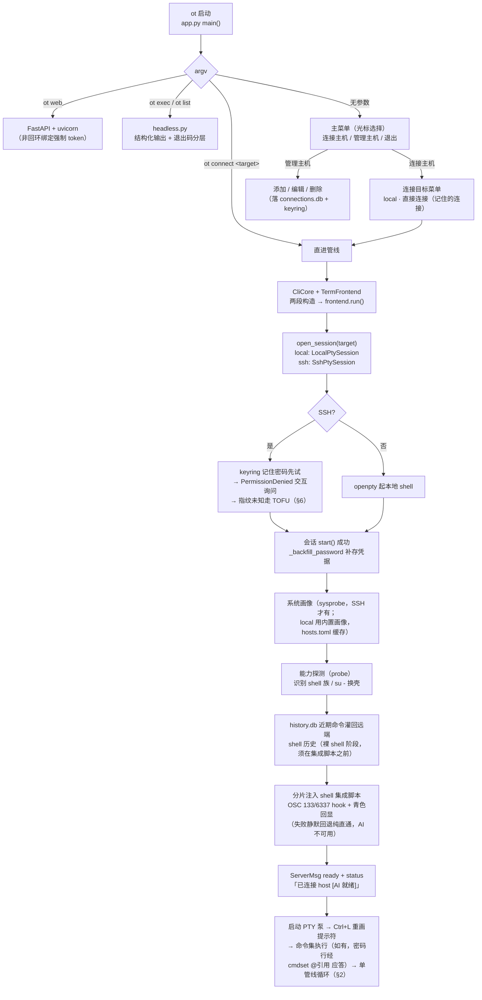
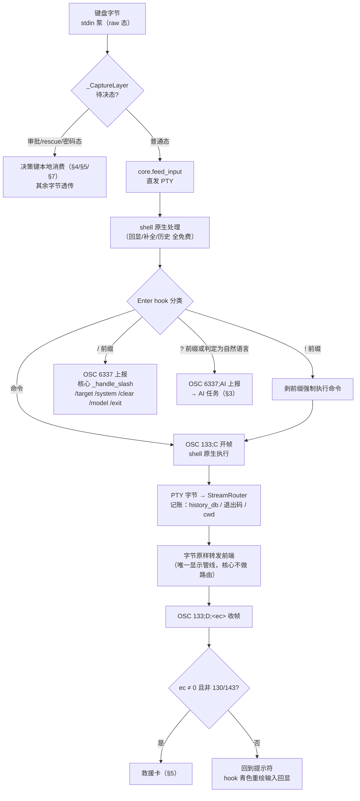
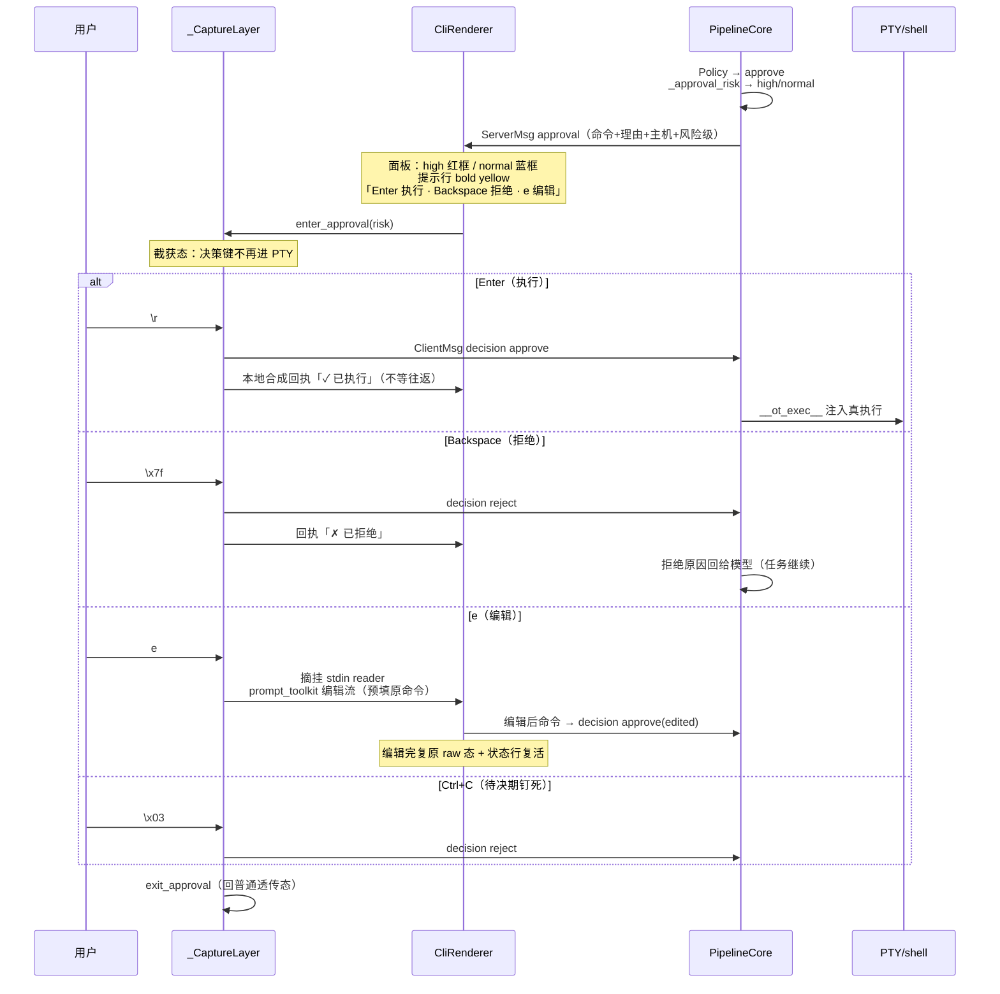
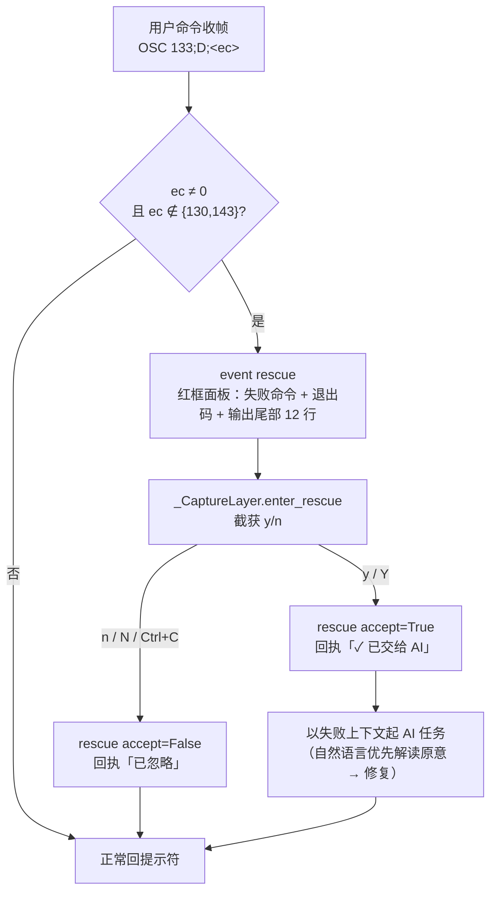
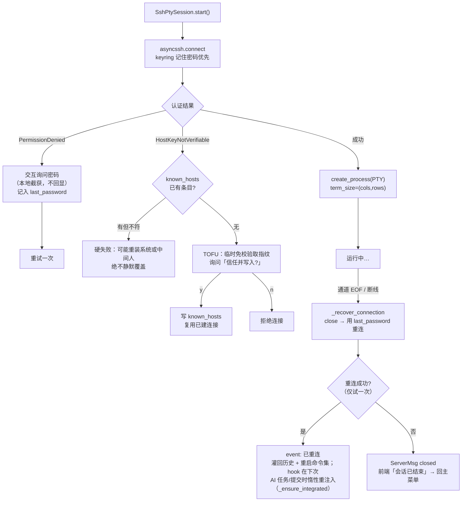
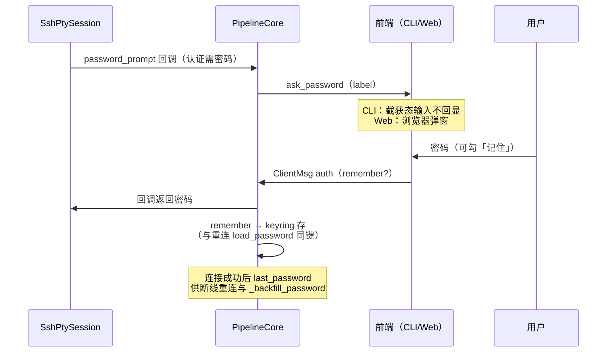
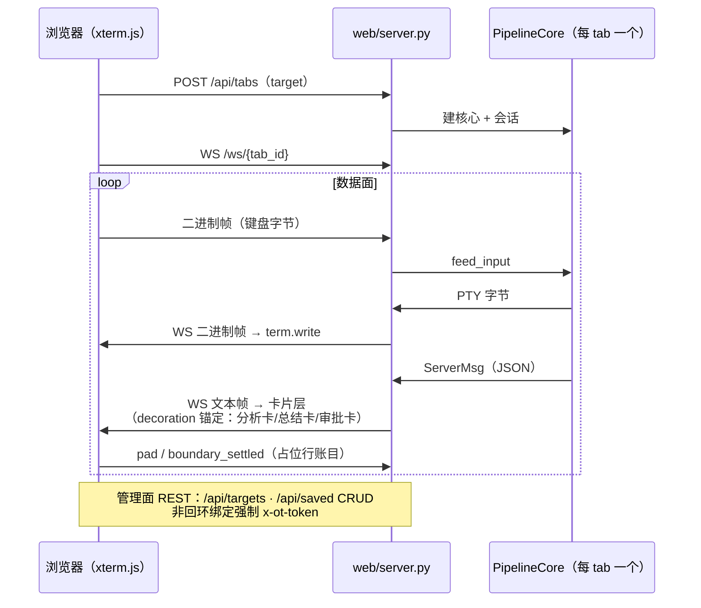
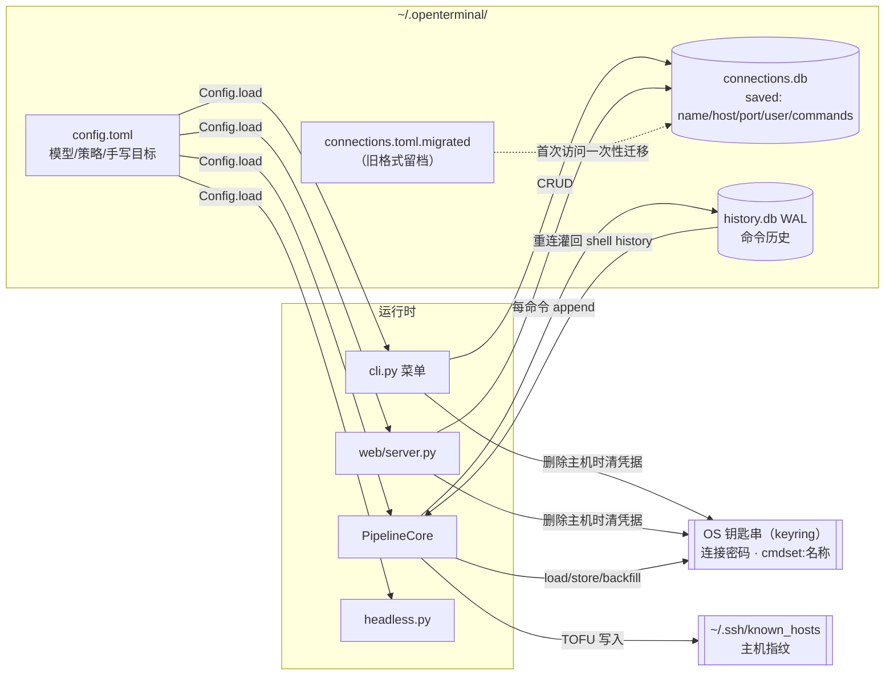

# OpenTerminal 流程图

> 状态：与代码同步（分支 feat/single-pipeline，2026-09）
> 配套阅读：[架构文档](architecture.md) · [设计说明](design.md)
> 全部为 mermaid，GitHub / VS Code 直接渲染。

## 1. 启动与连接建立（CLI）



## 2. 输入分类与命令执行（单管线主循环）



## 3. AI 任务时序（自然语言 → 工具执行 → 总结）

```mermaid
sequenceDiagram
    participant U as 用户
    participant FE as TermFrontend<br/>(CliRenderer)
    participant CORE as PipelineCore
    participant AG as TaskRunner<br/>(agent.py)
    participant PTY as PTY/shell

    U->>PTY: "帮我看看磁盘占用" + Enter
    PTY->>CORE: OSC 6337;AI 上报（hook 判定自然语言）
    CORE->>FE: event task_start
    Note over FE: 状态行点亮（spinner+计时+token）<br/>擦除协议 \r\x1b[K
    CORE->>AG: 起任务（thread_id 上下文）
    loop 流式
        AG->>CORE: think chunk
        CORE->>FE: event ai_think
        Note over FE: 蓝色思考框：行缓冲+显示宽折行<br/>（宽<24 退裸暗灰流）
        AG->>CORE: token chunk
        CORE->>FE: event ai_token
        Note over FE: 关思考框（无摘要行）<br/>正文流式直写（\n→\r\n 防阶梯）
    end
    AG->>CORE: 工具命令（如 df -h）
    CORE->>CORE: Policy 分级
    alt approve（高危）
        CORE->>FE: approval（§4 审批时序）
    else auto
        CORE->>PTY: __ot_exec__ 注入（幕帘闸扣留 live 文本）
        PTY-->>CORE: OSC 6337;EXEC 报告 + 输出字节
        CORE->>FE: 输出字节直写主终端（原样可见）
    end
    CORE->>FE: event ai_collapse（命令面板定格）
    AG->>CORE: final 总结
    CORE->>FE: event final / ai_card
    Note over FE: 关思考框 + 「… 思考 N 行」<br/>总结框（rich Panel）
    CORE->>FE: usage（token 计数）
    Note over FE: 状态行熄灭，无残留
    FE-->>U: 提示符可继续（AI 工作期间用户照样能敲命令）
```

## 4. 审批时序（HIL）



## 5. 失败救援流程



## 6. SSH 安全与韧性



## 7. 认证截获（密码 / 主机密钥）



## 8. Web 多 tab 数据面



## 9. 存储读写总览


